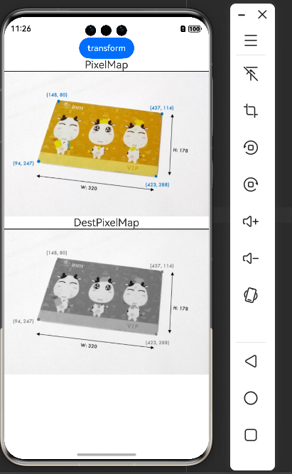
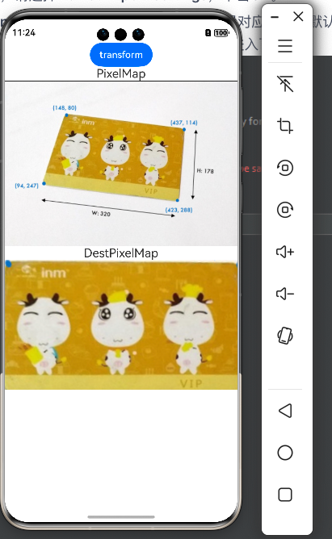

# Harmony ArkTS OpenCV Demo

本项目展示了如何在 HarmonyOS 应用中集成和使用 OpenCV 进行图像处理。

## 项目特点

- 集成轻量级 [opencv-mobile](https://github.com/nihui/opencv-mobile) 静态库
- 通过 NAPI 封装，为 ArkTS 提供 CV 能力
- 支持图像灰度转换和透视变换

## 功能演示

### 灰度变换

### 透视变换

## 技术实现

### 核心功能
- 基于 NAPI 的 CV 能力封装
- 图像数据 Buffer 直接传输处理
- 支持扩展更多 OpenCV 操作

### 技术选型
- 选用 opencv-mobile 替代 OpenCV 全量库
  - 优点：体积小，适合移动端
  - 注意：imread 直接读取图片会报错（没找到解决方案，因此传入 image buffer 进行处理）

## 技术参考

1. [DevEco Studio NAPI 工程开发指南](https://gitee.com/openharmony-sig/knowledge_demo_temp/blob/master/docs/napi_study/docs/hello_napi.md)
2. [OpenHarmony OpenCV 应用开发实践](https://forums.openharmony.cn/forum.php?mod=viewthread&tid=2218)
   - 文章的示例代码位于评论区
   - common.h 和 common.cpp 参考自该示例代码
